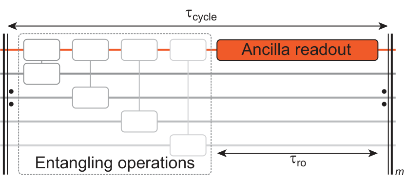

# Benchmarking the readout of a superconducting qubit for repeated measurements

S. Hazra,¹,* W. Dai,¹,* T. Connolly,¹ P. D. Kurilovich,¹ Z. Wang,¹ L. Frunzio,¹ and M. H. Devoret¹,†  

¹Department of Applied Physics, Yale University, New Haven, Connecticut 06520, USA  
and Yale Quantum Institute, Yale University, New Haven, Connecticut 06520, USA  

(Dated: July 16, 2024)  

Readout of superconducting qubits faces a trade-off between measurement speed and unwanted back-action on the qubit caused by the readout drive, such as \(T_1\) degradation and leakage out of the computational subspace. The readout is typically benchmarked by integrating the readout signal and choosing a binary threshold to extract the “readout fidelity”. We show that such a characterization may significantly overlook readout-induced leakage errors. We introduce a method to quantitatively assess this error by repeatedly executing a composite operation—a readout preceded by a randomized qubit-flip. We apply this technique to characterize the dispersive readout of an intrinsically Purcell-protected qubit. We report a binary readout fidelity of 99.63% and quantum non-demolition (QND) fidelity exceeding 99.00% which takes into account a leakage error rate of 0.12 ± 0.03%, under a repetition rate of \((380\text{ns})^{-1}\) for the composite operation.  

Fast and accurate single-shot qubit readout is crucial for a multitude of quantum computing experiments including, measurement-based state preparation [1], entanglement generation [2–4] and quantum error correction (QEC) [5–10]. Recent advancements in superconducting qubit readout coupled with near-quantum-limited measurement efficiency have made it possible to demonstrate quantum error correction with both surface code [8, 9] and bosonic codes [5–7]. In these experiments, efficient entropy removal from the quantum system is achieved by repeated application of high fidelity readout and reset of the physical ancilla qubits. A quantum non-demolition (QND) measurement [11] perfectly correlates the post-readout state of the qubit with the readout outcome, alleviating the need for unconditional reset [12] of the ancilla. A purely dispersive interaction between a qubit and its readout resonator would yield a QND readout scheme. In reality, this interaction is approximately realized in superconducting circuits [13] when an artificial atom is linearly coupled to the readout resonator. The linear hybridization of the qubit and the readout resonator leads to Purcell decay of the qubit. This prevents arbitrary increase of the qubit-resonator dispersive interaction \(\chi_{qr}\) and the external coupling rate of the resonator \(\kappa_r\), which sets a maximum speed of the readout for a given power. Moreover, at higher readout power, the dispersive approximation breaks down [14], causing readout-induced leakage [15, 16] into the non-computational states of the physical qubit. These limitations prohibit the simultaneous pursuit of the readout speed, fidelity and QND-ness.  

In QEC, entangling operations and ancilla readouts are repeated, as illustrated in Fig.1. The readout-induced leakage errors can leave the ancilla in undesirable highly-excited states for multiple cycles, and can also spread into neighbouring qubits [17]. Thus, even a small leakage probability poses a greater threat compared to discrimination error or Pauli error. Often, the “readout fidelity” [1, 18–23] extracted from the binary-thresholded outcomes is used as the only metric to experimentally optimize the readout parameters. While such a metric is sufficient to quantify the Pauli error (occurring during the readout process) and the discrimination error, it fails to faithfully identify readout-induced leakage, especially if the latter occurs with a low probability compared to other readout errors. The standard measure of QND-ness as the correlation of two successive binary readout outcomes [21–23] also overlooks leakage when the readout outcomes of the leakage states predominantly fall on one side of the threshold. Therefore, such methods do not reflect the true character of the repeated readout operations. Is there a complete way to benchmark the readout operation with binary outcome?  

In this Letter, we demonstrate a novel readout benchmarking technique, “pseudo-syndrome detection”, where we mimic a syndrome detection cycle in QEC by repeating a composite operation—a readout preceded by a random qubit flip. This method offers a faithful characterization of the readout under repeated implementations and provides an accurate estimation of the readout QND-ness. We perform the dispersive readout on a Purcell-protected transmon. We optimize the readout pulses  

  

Figure 1. A syndrome detection cycle in QEC. Each cycle consists of an ancilla readout preceded by entangling operations with data qubits, mapping the syndrome onto the ancilla. We characterize the readout performance by mimicking this experiment on a single ancilla, with the “syndrome” artificially generated by randomly applying identity and bit-flip operations.